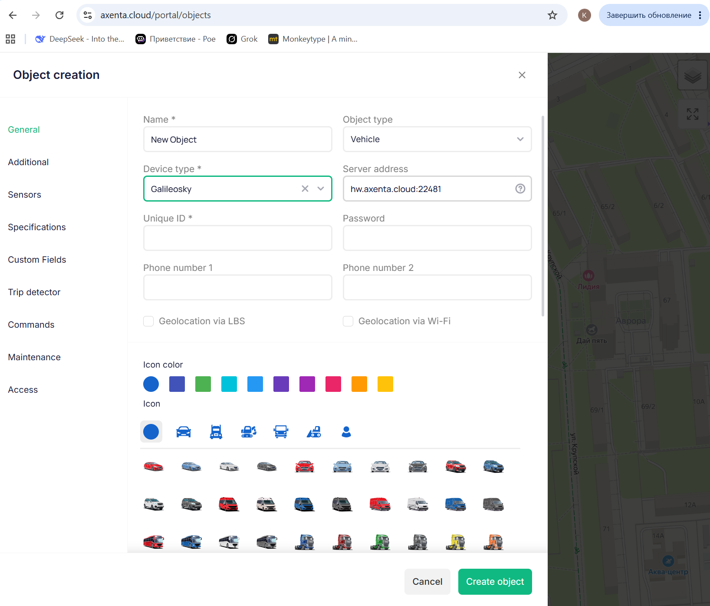
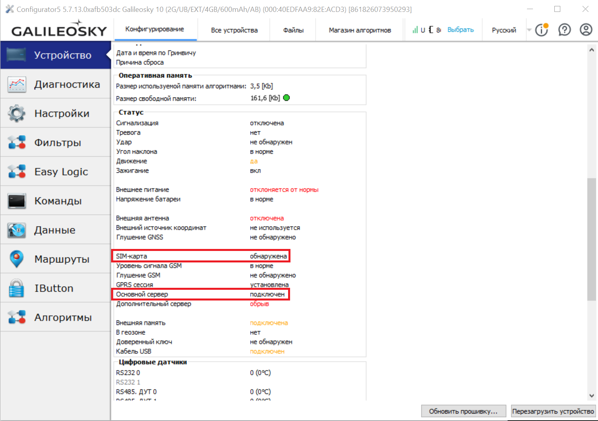
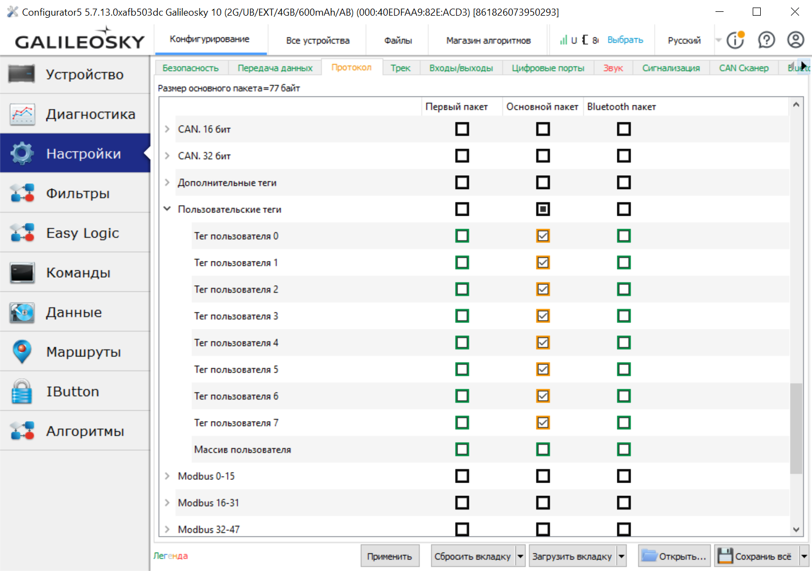
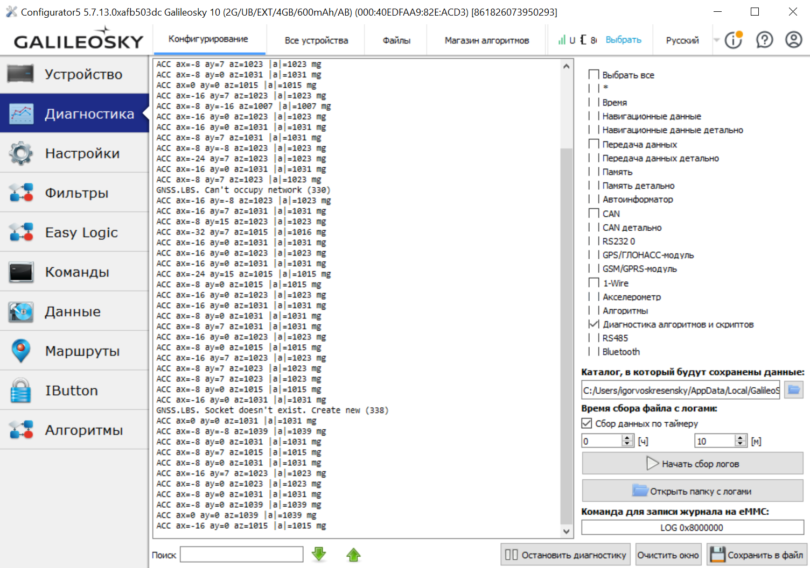

Настоящий документ описывает порядок развертывания системы мониторинга ТС, построенной на базе терминала спутниковой навигации Galileosky 10 с использованием дополнительных алгоритмов технологии Easy Logic. Руководство предназначено для специалиста, выполняющего установку терминала, его подключение к автомобилю, привязку к платформе спутникового мониторинга, а также для оператора, эксплуатирующего систему. Базовые операции работы с терминалами Galileosky и платформой Axenta в документе не дублируются, при необходимости следует пользоваться документацией производителей.

## 1 Состав системы

Для развертывания требуются: терминал Galileosky 10 с прошивкой последней версии, активированная SIM-карта оператора связи с поддержкой передачи данных и услуги отправки SMS-сообщений, комплектный жгут подключения к бортовой сети автомобиля, GSM-антенна и GNSS-антенна из комплекта поставки терминала, персональный компьютер с установленной программой Configurator от производителя терминала, USB-кабель для локального подключения терминала к компьютеру, бинарные файлы основного алгоритма «safedrive.bin» и калибровочного алгоритма «accel_dbg.bin».

## 2 Монтаж терминала в автомобиле

Терминал устанавливается в скрытом сухом месте салона автомобиля без прямого контакта с источниками тепла и без вибрационных нагрузок сверх штатных для конструкции автомобиля. Корпус терминала должен быть жестко закреплен к элементу кузова или внутренней панели, допускается использовать крепежный кронштейн, промышленный скотч или хомуты. Ориентация терминала в пространстве является критическим параметром для корректной работы детектора несанкционированного перемещения и модулей оценки стиля вождения и качества дорожного покрытия. Терминал устанавливается строго параллельно земле стороной с надписью Galileosky, этой стороной он должен быть направлен к земле. Стороной с выходами для антенн терминал должен быть направлен строго по направлению движения автомобиля.

## 3 Электрическое подключение

Подключения терминала рекомендуется производить через диагностический разъем ТС. Питание терминала выполняется от штатной бортовой сети автомобиля, через соответствующий пин разъема. На линии питания должен быть установлен предохранитель номинальным током 2 А. Минусовой провод подключается к точке кузовной массы автомобиля, либо к соответствующему пину диагностического разъема. Подключение к CAN-шине производится аналогично, через соответствующие пины диагностического разъема. Конкретные номера пинов могут различаться для каждого авто, поэтому они не указаны в руководстве. SIM-карта устанавливается в держатель терминала до подачи питания. После завершения подключения терминал инициализируется автоматически в течение 30–60 секунд.

## 4 Настройка терминала

1. Пройдите регистрацию на платформе Axenta (https://axenta.cloud/auth/login).

2. Добавьте объект через вкладку «Objects» - «+», введите всю необходимую информацию об устройстве. IMEI устройства указан на корпусе. При выборе типа устройства, выберите «Galileosky», после этого в поле «Server address» появится адрес и порт сервера, который необходимо скопировать, он понадобится позже. Нужное поле для выбора типа устройства можно наблюдать на рисунке В.4.1.

   

   *Рисунок В.4.1 – регистрация объекта мониторинга на платформе Axenta*

3. Установите программу Configurator с официального сайта Galileosky (https://galileosky.ru/podderzhka/konfigurator/).

4. Подключите терминал к компьютеру через USB-кабель и запустите программу Configurator. В разделе «Настройки» - «Сервер» укажите адрес и порт сервера платформы спутникового мониторинга, на которой будет регистрироваться объект. Для платформы Axenta, адрес и порт мы получили ранее. Сохраните настройки, перейдите в подраздел «Устройство» и убедитесь, что терминал устанавливает соединение с сервером и установленная SIM-карта обнаружена терминалом. Соответствующие строки статуса устройства обведены в красные прямоугольники на рисунке В.4.2.

   

   *Рисунок В.4.2 – статус подключения устройства к серверу*

5. Настройте передачу пользовательских тегов на сервер, используя вкладку «Настройки», как показано на рисунке В.4.3. Это необходимо для передачи данных системы и отображения их на платформе мониторинга.

   

   *Рисунок В.4.3 – настройка передачи пользовательских тегов на сервер*

## 5 Калибровка с помощью алгоритма accel_dbg

Загрузите в терминал бинарный файл «accel_dbg.bin» через раздел «EasyLogic» программы Configurator. После загрузки алгоритма и перезагрузки терминала алгоритм начнет каждые 500 миллисекунд печатать в системную диагностику терминала строку вида «ACC ax=… ay=… az=… |a|=… mg», где первые три значения – проекции ускорения на оси X, Y, Z в mg, а |a| – модуль вектора ускорения в mg. Перейдите в раздел «Диагностика» программы Configurator, на панели справа отметьте пункт «Диагностика алгоритмов и скриптов» и  наблюдайте за выводом. Пример вывода в указанном разделе можно наблюдать на рисунке В.5.

*Рисунок В.5 – диагностический вывод ускорения в Configurator*

Поставьте автомобиль на горизонтальную опорную поверхность. В покое значение вертикальной оси az должно быть близко к 1000, а два других – близки к нулю. Далее выполните контрольный разгон автомобиля по прямой ровной дороге: значение ay должно достигать положительных значений 200–400 mg в момент разгона и отрицательных значений того же порядка при торможении. При выполнении поворота, значение ax должно изменяться.

Если терминал устанавливается на грузовик, автобус или любое ТС, заметно отличающееся по характеристикам от легкового автомобиля, по значениям алгоритма можно провести калибровку, выявляя пороги различных параметров опытным путем, выполняя различные маневры – резкие повороты, торможения и разгоны. После получения значений калибровки, при необходимости, можно изменить настроенные пороговые значения. Описание этого процесса приведено в следующем пункте руководства.

## 6 Корректировка пороговых значений

Все используемые алгоритмом пороги имеют значения по умолчанию, подобранные для типового легкового автомобиля. При необходимости адаптации, значения могут быть изменены командой «SETSDPARAM» с двумя аргументами через запятую: индекс параметра от 1 до 12 и новое значение в единицах, указанных ниже. Для запроса текущего значения параметра используйте команду «GETSDPARAM» с одним аргументом – индексом, при индексе 0 терминал вернет полный перечень всех параметров с их значениями.

Индекс 1 – порог детектора ДТП в mg, значение по умолчанию 3000. Индекс 2 – антидребезг детектора ДТП в секундах, значение по умолчанию 60. Индекс 3 – порог детектора несанкционированного перемещения припаркованного автомобиля в mg, значение по умолчанию 300. Индекс 4 – минимальное время для квалификации состояния парковки в секундах, значение по умолчанию 30. Индекс 5 – порог регистрации неровности дороги в режиме оценки дороги в mg, значение по умолчанию 300. Индекс 6 – порог резкого ускорения в mg, значение по умолчанию 400. Индекс 7 – порог резкого торможения в mg, значение по умолчанию 400. Индекс 8 – порог резкого поворота в mg, значение по умолчанию 400. Индекс 9 – порог перегрева охлаждающей жидкости в градусах Цельсия, значение по умолчанию 105. Индекс 10 – нижняя граница нормального заряда АКБ в милливольтах, значение по умолчанию 12400. Индекс 11 – верхняя граница критически низкого заряда АКБ в милливольтах, значение по умолчанию 11800. Индекс 12 – время устойчивого простоя для считания зажигания выключенным в секундах, значение по умолчанию 600. Измененные значения сохраняются в энергонезависимой памяти терминала и переживают перезагрузку.

## 7 Сохранение номера для аварийных SMS-уведомлений

При возникновении ДТП или при обнаружении несанкционированного перемещения, система автоматически отправляет короткое SMS-сообщение на заранее заданный номер с указанием типа события, фактического модуля ускорения в g, координат и IMEI терминала. Для сохранения номера телефона для последующей отправки на него таких SMS, отправьте на терминал команду «SETSMSNUM» с одним аргументом – номером в международном формате длиной не более пятнадцати символов, например «SETSMSNUM 79991234567». Терминал ответит подтверждением OK. Для проверки сохраненного номера используйте команду «GETSMSNUM». Без сохраненного номера события продолжают регистрироваться на сервере, но SMS-уведомление отправлено не будет.

## 8 Загрузка алгоритма safedrive

В разделе «EasyLogic» программы Configurator выберите файл «safedrive.bin» и выполните загрузку. После завершения загрузки в разделе «Устройство» должно отобразиться имя загруженного алгоритма. По завершении загрузки выполните перезагрузку терминала командой «RESET» или через раздел «Команды». На этом, настройка системы завершена. Далее, в руководстве будут описаны возможности мониторинга системы и отладочные механизмы для ее проверки.

## 9 Отображение оценок и событий на платформе Axenta

Алгоритм отправляет на сервер платформы восемь тегов, в которых передаются основные данные системы. Расшифровка значения каждого тега представлена ниже.

Датчик пользовательского тега 0 «ДТП», тип сенсора – мгновенное значение, значение 1 интерпретируется как зарегистрированное дорожно-транспортное происшествие. Датчик пользовательского тега 1 «Несанкционированное перемещение», значение 1 интерпретируется как буксировка, эвакуация или удар по припаркованному автомобилю. Датчик пользовательского тега 2 «Перегрев двигателя», значение 1 интерпретируется как начало нового перегрева. Датчик пользовательского тега 3 «Счетчик перегревов», значение представляет общее число перегревов с момента последнего сброса. Датчик пользовательского тега 4 «Состояние АКБ», значение расшифровывается так: 0 – норма, 1 – слабая, рекомендуется наблюдение; 2 – низкая, рекомендуется проверка; 3 – критическая, рекомендуется замена. Датчик пользовательского тега 5 «Оценка стиля вождения», значение является оценкой по шкале от 1 до 5: 5 – спокойное, 4 – умеренно активное, 3 – активное, 2 – агрессивное, 1 – очень агрессивное. Датчик пользовательского тега 6 «Оценка качества дороги», значение является оценкой по шкале от 1 до 5: 5 – идеальная, 4 – хорошая, 3 – удовлетворительная, 2 – плохая, 1 – очень плохая. Датчик пользовательского тега 7 «Перезагрузка терминала», значение 1 – терминал перезагружен.

## 10 Команды управления режимами оценки

Оценка качества дорожного покрытия и оценка стиля вождения активируются по команде с сервера. Для запуска сессии оценки дороги отправьте команду «STARTROADQ», после ее отправки алгоритм начинает накопление статистики и подтверждает запуск ответом «ROADQ STARTED». Для остановки сессии и получения итогового балла отправьте команду «STOPROADQ», в ответ на нее терминал возвращает балл от 1 до 5 и публикует его в тег «Оценка качества дороги». Для запуска сессии скоринга агрессивности вождения отправьте команду «STARTSCORING», для получения промежуточного балла без остановки сессии – «GETSCORE», для остановки и получения итогового балла – «STOPSCORING». Итоговый балл публикуется в тег «Оценка стиля вождения». Сессии обоих типов после перезагрузки терминала автоматически не возобновляются, их необходимо запустить повторно.

## 11 Команды управления счетчиками

Для получения текущих значений счетчика перегревов и суммарного времени, проведенного в перегреве, отправьте команду «GETOVERHEAT», терминал вернет ответ «OVERHEAT count=N total=K», где N – число событий, K – суммарное время в секундах. Для сброса обоих счетчиков, отправьте команду «RESETOVERHEAT». Для получения последнего зафиксированного напряжения покоя АКБ и соответствующего кода состояния отправьте команду «GETBATSTAT», терминал вернет ответ «BAT mv=K code=C», где K – напряжение покоя АКБ в милливольтах, зафиксированное непосредственно перед последним запуском двигателя, а C – код состояния аккумулятора, расшифровку его значения можно найти в предыдущем пункте.

## 12 Проверка работоспособности на стенде

При необходимости, можно  выполнить проверочные тесты с использованием отладочных команд, без установки терминала на автомобиль. Команда «SIMACCEL» с тремя аргументами через запятую, аргументы – значения проекций ускорения на оси X, Y, Z в сырых единицах акселерометра в диапазоне от минус 32768 до плюс 32767, подменяет реальные показания акселерометра указанными значениями. Команда «SIMENV» с двумя аргументами через запятую, где аргументы – напряжение бортовой сети в милливольтах и температура охлаждающей жидкости в градусах Цельсия, подменяет соответствующие показания. Команда «SIMOFF» возвращает терминал к чтению реальных датчиков.
